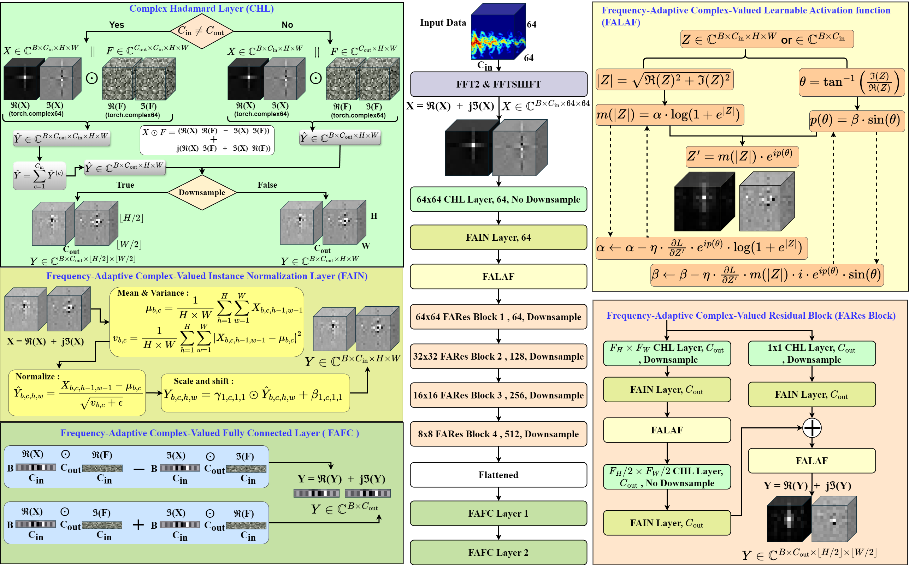

Complex-Valued Convolutional Neural Network with Learnable Activation Function for Frequency-Domain Radar Signal Processing
===========
This repository contains code which reproduces experiments presented in the paper [Complex-Valued Convolutional Neural Network with Learnable Activation Function for Frequency-Domain Radar Signal Processing](https://papers.ssrn.com/sol3/papers.cfm?abstract_id=5215117).

	
	 
	<em>The Architecture of the proposed frequency-adaptive complex-valued convolutional neural network.</em>

## Requirements

The main requirements are listed below:

* Tested with NVIDIA RTX A5000 GPU with 24GB of memory
* Tested with CUDA 12.1 and CuDNN 9.8.2
* Python 3.10.13
* Ubuntu 20.04.3
* PyTorch 2.3.1+cu121
* torchvision 0.18.1
* matplotlib 3.8.3
* Numpy
